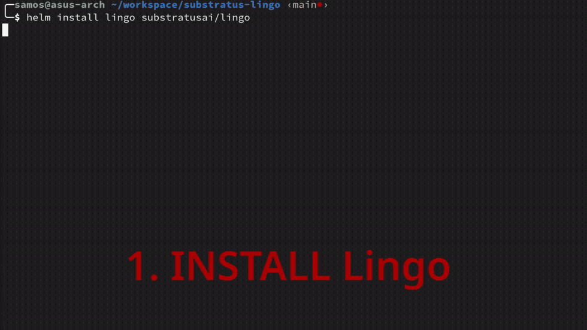

# Lingo

Lingo is a lightweight, scale-from-zero ML model proxy and that runs on Kubernetes. Lingo allows you to run text-completion and embedding servers in your own project without changing any of your OpenAI client code. Large scale batch processing is as simple as configuring Lingo to consume-from and publish-to your favorite messaging system (AWS SQS, GCP PubSub, Azure Service Bus, Kafka, and more).

🚀  Serve OSS LLMs on CPUs or GPUs  
✅️  Compatible with the OpenAI API  
✉️  Plug-and-play with most messaging systems (Kafka, etc.)  
⚖️  Scale from zero, autoscale based on load  
…  Queue requests to avoid overloading models  
🛠️  Zero dependencies (no Istio, Knative, etc.)   
⦿  Namespaced - no cluster privileges needed

<a href="https://discord.gg/JeXhcmjZVm">

</a>

Support the project by adding a star! ⭐️



## Quickstart

This quickstart will walk through installing Lingo and demonstrating how it scales models from zero. This should work on any Kubernetes cluster (GKE, EKS, AKS, Kind).

Start by adding and updating the Substratus Helm repo.

```bash
helm repo add substratusai https://substratusai.github.io/helm
helm repo update
```

Install Lingo.

```bash
helm install lingo substratusai/lingo
```

Deploy an embedding model (runs on CPUs).

```bash
helm upgrade --install stapi-minilm-l6-v2 substratusai/stapi -f - << EOF
model: all-MiniLM-L6-v2
replicaCount: 0
deploymentAnnotations:
  lingo.substratus.ai/models: text-embedding-ada-002
EOF
```

Deploy the Mistral 7B Instruct LLM using vLLM (GPUs are required).

```bash
helm upgrade --install mistral-7b-instruct substratusai/vllm -f - << EOF
model: mistralai/Mistral-7B-Instruct-v0.1
replicaCount: 0
env:
- name: SERVED_MODEL_NAME
  value: mistral-7b-instruct-v0.1 # needs to be same as lingo model name
deploymentAnnotations:
  lingo.substratus.ai/models: mistral-7b-instruct-v0.1
  lingo.substratus.ai/min-replicas: "0" # needs to be string
  lingo.substratus.ai/max-replicas: "3" # needs to be string
EOF
```

All model deployments currently have 0 replicas. Lingo will scale the Deployment in response to the first HTTP request.

By default, the proxy is only accessible within the Kubernetes cluster. To access it from your local machine, set up a port forward.

```bash
kubectl port-forward svc/lingo 8080:80
```

In a separate terminal watch the Pods.

```bash
watch kubectl get pods
```

Get embeddings by using the OpenAI compatible HTTP API.

```bash
curl http://localhost:8080/v1/embeddings \
  -H "Content-Type: application/json" \
  -d '{
    "input": "Lingo rocks!",
    "model": "text-embedding-ada-002"
  }'
```

You should see a model Pod being created on the fly that
will serve the request. The first request will wait for this Pod to become ready.

If you deployed the Mistral 7B LLM, try sending it a request as well.

```bash
curl http://localhost:8080/v1/completions \
  -H "Content-Type: application/json" \
  -d '{"model": "mistral-7b-instruct-v0.1", "prompt": "<s>[INST]Who was the first president of the United States?[/INST]", "max_tokens": 40}'
```

The first request to an LLM takes longer because of the size of the model. Subsequent request should be much quicker.

Checkout [substratus.ai](https://www.substratus.ai) to learn more about the managed hybrid-SaaS offering. Substratus allows you to run Lingo in your cloud account, while benefiting from extensive cluster performance addons that can dramatically reduce startup times and boost throughput.

## Creators

Let us know about features you are interested in seeing or reach out with questions. [Visit our Discord channel](https://discord.gg/JeXhcmjZVm) to join the discussion!

Or just reach out on LinkedIn if you want to connect:

* [Nick Stogner](https://www.linkedin.com/in/nstogner/)
* [Sam Stoelinga](https://www.linkedin.com/in/samstoelinga/)
