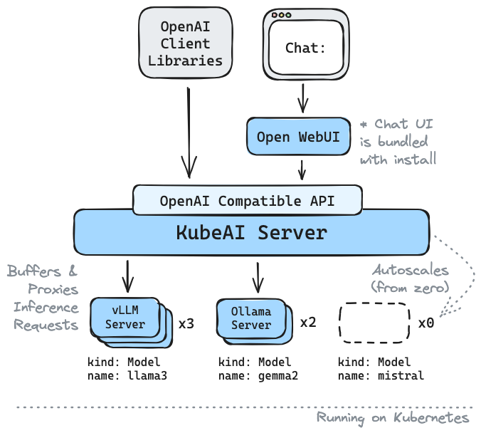

# KubeAI: Private Open AI on Kubernetes

The simple AI platform that runs on Kubernetes.

> "KubeAI is highly scalable, yet compact enough to fit on my old laptop."
> \- Some Google Engineer

✅️  Drop-in replacement for OpenAI with API compatibility  
🚀  Serve OSS LLMs on CPUs or GPUs  
⚖️  Scale from zero, autoscale based on load  
🛠️  Zero dependencies (no Istio, Knative, etc.)   
🤖  Operates OSS model servers (vLLM and Ollama)  
🔋  Additional OSS addons included ([OpenWebUI](https://github.com/open-webui/open-webui) i.e. ChatGPT UI)  
✉️  Plug-n-play with cloud messaging systems (Kafka, PubSub, etc.)

## Architecture

KubeAI serves an OpenAI compatible HTTP API. Admins can configure ML models via `kind: Model` Kubernetes Custom Resources. KubeAI can be thought of as a Model Operator (See [Operator Pattern](https://kubernetes.io/docs/concepts/extend-kubernetes/operator/)) that manages [vLLM](https://github.com/vllm-project/vllm) and [Ollama](https://github.com/ollama/ollama) servers.

</img>

## Local Quickstart


<video controls src="https://github.com/user-attachments/assets/711d1279-6af9-4c6c-a052-e59e7730b757" width="800"></video>

Create a local cluster using [kind](https://kind.sigs.k8s.io/) or [minikube](https://minikube.sigs.k8s.io/docs/).

<details>
<summary>TIP: If you are using Podman for kind...</summary>
Make sure your Podman machine can use up to 6G of memory (by default it is capped at 2G):

```bash
# You might need to stop and remove the existing machine:
podman machine stop
podman machine rm

# Init and start a new machine:
podman machine init --memory 6144
podman machine start
```
</details>


```bash
kind create cluster # OR: minikube start
```

Add the KubeAI [Helm](https://helm.sh/docs/intro/install/) repository.

```bash
helm repo add kubeai https://substratusai.github.io/kubeai/
helm repo update
```

Install KubeAI and wait for all components to be ready (may take a minute).

```bash
cat <<EOF > helm-values.yaml
models:
  catalog:
    gemma2-2b-cpu:
      enabled: true
      minReplicas: 1
    qwen2-500m-cpu:
      enabled: true
    nomic-embed-text-cpu:
      enabled: true
EOF

helm upgrade --install kubeai kubeai/kubeai \
    -f ./helm-values.yaml \
    --wait --timeout 10m
```

Before progressing to the next steps, start a watch on Pods in a standalone terminal to see how KubeAI deploys models. 

```bash
kubectl get pods --watch
```

#### Interact with Gemma2

Because we set `minReplicas: 1` for the Gemma model you should see a model Pod already coming up.

Start a local port-forward to the bundled chat UI.

```bash
kubectl port-forward svc/openwebui 8000:80
```

Now open your browser to [localhost:8000](http://localhost:8000) and select the Gemma model to start chatting with.

#### Scale up Qwen2 from Zero

If you go back to the browser and start a chat with Qwen2, you will notice that it will take a while to respond at first. This is because we set `minReplicas: 0` for this model and KubeAI needs to spin up a new Pod (you can verify with `kubectl get models -oyaml qwen2-500m-cpu`).

NOTE: Autoscaling after initial scale-from-zero is not yet supported for the Ollama backend which we use in this local quickstart. KubeAI relies upon backend-specific metrics and the Ollama project has an open issue: https://github.com/ollama/ollama/issues/3144. To see autoscaling in action, checkout the [GKE install guide](./installation/gke.md) which uses the vLLM backend and autoscales across GPU resources.

## Supported Models

Any vLLM or Ollama model can be served by KubeAI. Some examples of popular models served on KubeAI include:

* Llama v3.1 (8B, 70B, 405B) 
* Gemma2 (2B, 9B, 27B)
* Qwen2 (1.5B, 7B, 72B)

## Documentation

Checkout our documenation on [kubeai.org](https://www.kubeai.org) to find info on:

* Installing KubeAI in the cloud
* How to guides (e.g. how to manage models and resource profiles).
* Concepts (how the components of KubeAI work).
* How to contribute

## OpenAI API Compatibility

```bash
# Implemented #
/v1/chat/completions
/v1/completions
/v1/embeddings
/v1/models

# Planned #
# /v1/assistants/*
# /v1/batches/*
# /v1/fine_tuning/*
# /v1/images/*
# /v1/vector_stores/*
```

## Immediate Roadmap

* Model caching
* LoRA finetuning (compatible with OpenAI finetuning API)
* Image generation (compatible with OpenAI images API)

*NOTE:* KubeAI was born out of a project called Lingo which was a simple Kubernetes LLM proxy with basic autoscaling. We relaunched the project as KubeAI (late August 2024) and expanded the roadmap to what it is today.

🌟 Don't forget to drop us a star on GitHub and follow the repo to stay up to date!

[](https://star-history.com/#substratusai/kubeai&Date)

## Contact

Let us know about features you are interested in seeing or reach out with questions. [Visit our Discord channel](https://discord.gg/JeXhcmjZVm) to join the discussion!

Or just reach out on LinkedIn if you want to connect:

* [Nick Stogner](https://www.linkedin.com/in/nstogner/)
* [Sam Stoelinga](https://www.linkedin.com/in/samstoelinga/)
