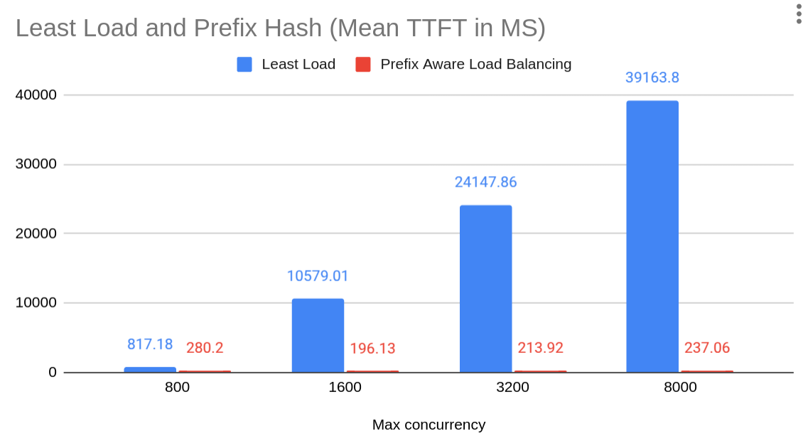
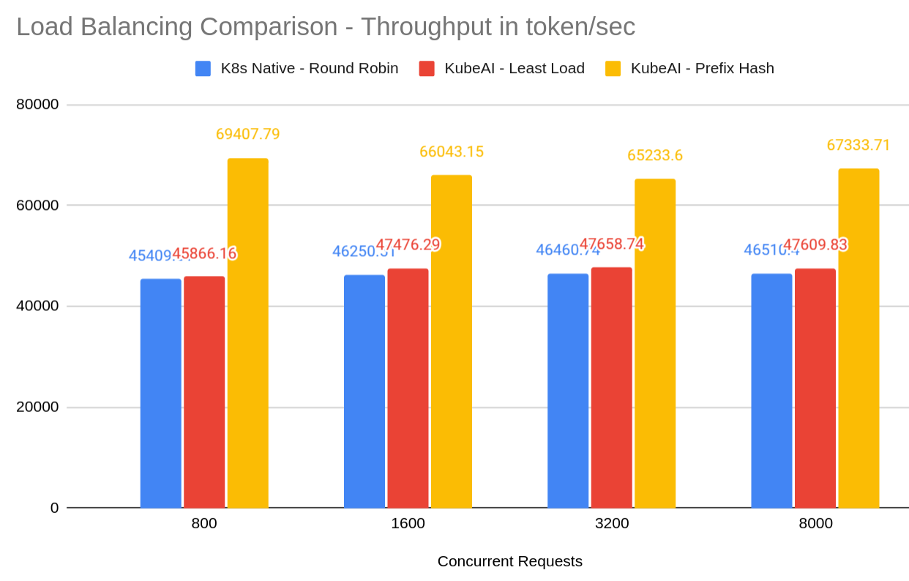

# Benchmarking Prefix Aware Load Balancing

Prefix Aware Load Balancing is able to improve throughput, inter-token latency and Time To First Token (TTFT). Even under
heavy load the Time to First Token stays stable.

The benchmarks demonstrate the following improvements by enabling Prefix Aware Load Balancing under heavy load (8000 concurrent requests):

* 164x improvement in Mean TTFT from 39163.80 ms to 237.06 ms.
* 41% increased throughput (total token/second) from 47609.83 to 67333.71.
* 143% improvement in inter-token latency from 194.44 ms 79.90 ms.

The benchmarks compare the following load balancing strategies:
* Kubernetes Native Service - Round Robin. Randomly distribute requests across all instances.
* KubeAI - Least Load. Send the request to the instance that is handling the least amount of requests.
* KubeAI - Prefix Hash. Send the request to an instance that has already handled the same prefix or portial prefix.

The benchmarks were run on 8 instances of vLLM serving LLama 3.1 8B and each uses a single L4 GPU. vLLM was configured to utilize prefix caching.

The ShareGPT dataset was purposely crafted such that prompts shared partial prefixes. See more about dataset in the dataset section.
Performance gains are lower when the amount of partial prefix re-use
is less.

Comparing the Mean TTFT for each Load Balancing strategy.



We can see that as the engine becomes overloaded, the Mean TTFT increases significantly for both K8s Native service and KubeAI Least Load. However,
KubeAI Prefix Aware Load Balancing is able to achieve a stable TTFT even
under heavy load.

Comparing the throughput in tokens per second for each load balancing strategy:



The graph shows that even at low load you can get a significant improvement in throughput by enabling Prefix Aware Load Balancing.

## Dataset preparation


## Benchmarking Setup

8 replicas of llama 3 8b and each uses a single L4 GPU


The following model was deployed in KubeAI:

```yaml
apiVersion: kubeai.org/v1
kind: Model
metadata:
  name: llama-3.1-8b-instruct-fp8-l4
spec:
  features: [TextGeneration]
  url: hf://neuralmagic/Meta-Llama-3.1-8B-Instruct-FP8
  engine: VLLM
  env:
    VLLM_USE_V1: "1"
  args:
  - --enable-prefix-caching
  - --max-model-len=16384
  - --max-num-batched-token=16384
  - --gpu-memory-utilization=0.95
  - --disable-log-requests
  - --kv-cache-dtype=fp8
  resourceProfile: nvidia-gpu-l4:1
  minReplicas: 8
  maxReplicas: 8
```

In order to test Prefix Aware Load Balancing, we modify the load balancing
strategy on the model object itself:

```sh
kubectl patch model llama-3.1-8b-instruct-fp8-l4 --type='merge' \
  -p '{"spec": {"loadBalancing": {"strategy": "PrefixHash"}}}'
```
This takes effect right away and does not require recreation of the pods.


K8s native service was tested by sending requests directly
to the K8s service instead of the KubeAI proxy/LB. This allows us
to test the default K8s service Round Robin based load balancing.

This was the K8s Service used:
```yaml
apiVersion: v1
kind: Service
metadata:
  name: vllm-direct
  labels:
    app: vllm-direct
spec:
  selector:
    app.kubernetes.io/name: vllm
  ports:
    - name: http
      protocol: TCP
      port: 80
      targetPort: 8000
  type: ClusterIP
```

## 800 concurrent requests

```yaml
      containers:
        - name: benchmark-serving
          image: substratusai/benchmark_serving:v0.0.1
          args:
            - --base-url=http://kubeai/openai
            - --dataset-name=sharegpt
            - --dataset-path=/app/sharegpt_16_messages_or_more.json
            - --model=llama-3.1-8b-instruct-fp8-l4
            - --seed=12345
            - --tokenizer=neuralmagic/Meta-Llama-3.1-8B-Instruct-FP8
            - --request-rate=800
            - --max-concurrency=800
            - --num-prompts=8000
            - --max-conversations=800
      restartPolicy: Never
```

### K8s Service - Round Robin (No KubeAI proxy)

```
============ Serving Benchmark Result ============
Successful requests:                     8000      
Benchmark duration (s):                  159.98    
Total input tokens:                      6656338   
Total generated tokens:                  608447    
Request throughput (req/s):              50.01     
Output token throughput (tok/s):         3803.20   
Total Token throughput (tok/s):          45409.81  
---------------Time to First Token----------------
Mean TTFT (ms):                          1319.77   
Median TTFT (ms):                        601.29    
P99 TTFT (ms):                           7438.41   
-----Time per Output Token (excl. 1st token)------
Mean TPOT (ms):                          189.29    
Median TPOT (ms):                        184.76    
P99 TPOT (ms):                           486.16    
---------------Inter-token Latency----------------
Mean ITL (ms):                           173.06    
Median ITL (ms):                         94.60     
P99 ITL (ms):                            715.66    
==================================================
```

### KubeAI - Least Load

```
============ Serving Benchmark Result ============
Successful requests:                     8000      
Benchmark duration (s):                  158.39    
Total input tokens:                      6656338   
Total generated tokens:                  608447    
Request throughput (req/s):              50.51     
Output token throughput (tok/s):         3841.42   
Total Token throughput (tok/s):          45866.16  
---------------Time to First Token----------------
Mean TTFT (ms):                          817.18    
Median TTFT (ms):                        494.28    
P99 TTFT (ms):                           5551.81   
-----Time per Output Token (excl. 1st token)------
Mean TPOT (ms):                          191.44    
Median TPOT (ms):                        183.18    
P99 TPOT (ms):                           520.48    
---------------Inter-token Latency----------------
Mean ITL (ms):                           176.03    
Median ITL (ms):                         124.55    
P99 ITL (ms):                            691.97    
==================================================
```

### KubeAI - Prefix Hash

```
============ Serving Benchmark Result ============
Successful requests:                     8000      
Benchmark duration (s):                  104.67    
Total input tokens:                      6656338   
Total generated tokens:                  608447    
Request throughput (req/s):              76.43     
Output token throughput (tok/s):         5813.11   
Total Token throughput (tok/s):          69407.79  
---------------Time to First Token----------------
Mean TTFT (ms):                          280.20    
Median TTFT (ms):                        239.80    
P99 TTFT (ms):                           1260.53   
-----Time per Output Token (excl. 1st token)------
Mean TPOT (ms):                          86.55     
Median TPOT (ms):                        91.13     
P99 TPOT (ms):                           139.47    
---------------Inter-token Latency----------------
Mean ITL (ms):                           85.78     
Median ITL (ms):                         77.35     
P99 ITL (ms):                            272.04    
==================================================
```


## 1600 concurrent requests

```yaml
apiVersion: batch/v1
kind: Job
metadata:
  name: benchmark-serving
spec:
  template:
    spec:
      containers:
        - name: benchmark-serving
          image: substratusai/benchmark_serving:v0.0.1
          args:
            - --base-url=http://kubeai/openai
            - --dataset-name=sharegpt
            - --dataset-path=/app/sharegpt_16_messages_or_more.json
            - --model=llama-3.1-8b-instruct-fp8-l4
            - --seed=12345
            - --tokenizer=neuralmagic/Meta-Llama-3.1-8B-Instruct-FP8
            - --request-rate=200
            - --max-concurrency=1600
            - --num-prompts=8000
            - --max-conversations=800
      restartPolicy: Never
```

### K8s Service - Round Robin

```
============ Serving Benchmark Result ============
Successful requests:                     8000      
Benchmark duration (s):                  157.07    
Total input tokens:                      6656338   
Total generated tokens:                  608447    
Request throughput (req/s):              50.93     
Output token throughput (tok/s):         3873.62   
Total Token throughput (tok/s):          46250.51  
---------------Time to First Token----------------
Mean TTFT (ms):                          10365.29  
Median TTFT (ms):                        10068.73  
P99 TTFT (ms):                           22283.86  
-----Time per Output Token (excl. 1st token)------
Mean TPOT (ms):                          216.53    
Median TPOT (ms):                        207.58    
P99 TPOT (ms):                           607.73    
---------------Inter-token Latency----------------
Mean ITL (ms):                           197.37    
Median ITL (ms):                         90.35     
P99 ITL (ms):                            749.96    
==================================================
```


### KubeAI - Least Load

```
============ Serving Benchmark Result ============
Successful requests:                     8000      
Benchmark duration (s):                  153.02    
Total input tokens:                      6656338   
Total generated tokens:                  608447    
Request throughput (req/s):              52.28     
Output token throughput (tok/s):         3976.28   
Total Token throughput (tok/s):          47476.29  
---------------Time to First Token----------------
Mean TTFT (ms):                          10579.01  
Median TTFT (ms):                        11501.96  
P99 TTFT (ms):                           15514.10  
-----Time per Output Token (excl. 1st token)------
Mean TPOT (ms):                          212.39    
Median TPOT (ms):                        202.98    
P99 TPOT (ms):                           613.06    
---------------Inter-token Latency----------------
Mean ITL (ms):                           193.34    
Median ITL (ms):                         92.65     
P99 ITL (ms):                            747.65    
==================================================
```

### KubeAI - Prefix Hash

```
============ Serving Benchmark Result ============
Successful requests:                     8000      
Benchmark duration (s):                  110.00    
Total input tokens:                      6656338   
Total generated tokens:                  608447    
Request throughput (req/s):              72.73     
Output token throughput (tok/s):         5531.31   
Total Token throughput (tok/s):          66043.15  
---------------Time to First Token----------------
Mean TTFT (ms):                          196.13    
Median TTFT (ms):                        184.29    
P99 TTFT (ms):                           492.33    
-----Time per Output Token (excl. 1st token)------
Mean TPOT (ms):                          78.51     
Median TPOT (ms):                        81.50     
P99 TPOT (ms):                           117.36    
---------------Inter-token Latency----------------
Mean ITL (ms):                           79.20     
Median ITL (ms):                         70.36     
P99 ITL (ms):                            249.71    
==================================================
```

## 3200 concurrent requests

job:
```yaml
        - name: benchmark-serving
          image: substratusai/benchmark_serving:v0.0.1
          args:
            - --base-url=http://kubeai/openai
            - --dataset-name=sharegpt
            - --dataset-path=/app/sharegpt_16_messages_or_more.json
            - --model=llama-3.1-8b-instruct-fp8-l4
            - --seed=12345
            - --tokenizer=neuralmagic/Meta-Llama-3.1-8B-Instruct-FP8
            - --request-rate=200
            - --max-concurrency=3200
            - --num-prompts=8000
            - --max-conversations=800
```

### K8s Native - Round Robin

```
============ Serving Benchmark Result ============
Successful requests:                     8000      
Benchmark duration (s):                  156.36    
Total input tokens:                      6656338   
Total generated tokens:                  608447    
Request throughput (req/s):              51.16     
Output token throughput (tok/s):         3891.22   
Total Token throughput (tok/s):          46460.74  
---------------Time to First Token----------------
Mean TTFT (ms):                          27183.41  
Median TTFT (ms):                        31260.66  
P99 TTFT (ms):                           51797.57  
-----Time per Output Token (excl. 1st token)------
Mean TPOT (ms):                          214.63    
Median TPOT (ms):                        205.61    
P99 TPOT (ms):                           629.95    
---------------Inter-token Latency----------------
Mean ITL (ms):                           195.30    
Median ITL (ms):                         88.07     
P99 ITL (ms):                            742.53    
==================================================
```

### KubeAI - Least Load

```
============ Serving Benchmark Result ============
Successful requests:                     8000      
Benchmark duration (s):                  152.43    
Total input tokens:                      6656338   
Total generated tokens:                  608447    
Request throughput (req/s):              52.48     
Output token throughput (tok/s):         3991.56   
Total Token throughput (tok/s):          47658.74  
---------------Time to First Token----------------
Mean TTFT (ms):                          24147.86  
Median TTFT (ms):                        25580.61  
P99 TTFT (ms):                           46021.48  
-----Time per Output Token (excl. 1st token)------
Mean TPOT (ms):                          211.98    
Median TPOT (ms):                        201.97    
P99 TPOT (ms):                           598.14    
---------------Inter-token Latency----------------
Mean ITL (ms):                           192.94    
Median ITL (ms):                         93.29     
P99 ITL (ms):                            721.71    
==================================================
```

### KubeAI - Prefix Hash

```
============ Serving Benchmark Result ============
Successful requests:                     8000      
Benchmark duration (s):                  111.37    
Total input tokens:                      6656338   
Total generated tokens:                  608447    
Request throughput (req/s):              71.84     
Output token throughput (tok/s):         5463.50   
Total Token throughput (tok/s):          65233.60  
---------------Time to First Token----------------
Mean TTFT (ms):                          213.92    
Median TTFT (ms):                        188.53    
P99 TTFT (ms):                           838.35    
-----Time per Output Token (excl. 1st token)------
Mean TPOT (ms):                          78.73     
Median TPOT (ms):                        82.17     
P99 TPOT (ms):                           122.60    
---------------Inter-token Latency----------------
Mean ITL (ms):                           78.49     
Median ITL (ms):                         70.32     
P99 ITL (ms):                            242.44    
==================================================
```

## concurrent requests 8000

```
        - name: benchmark-serving
          image: substratusai/benchmark_serving:v0.0.1
          args:
            - --base-url=http://kubeai/openai
            - --dataset-name=sharegpt
            - --dataset-path=/app/sharegpt_16_messages_or_more.json
            - --model=llama-3.1-8b-instruct-fp8-l4
            - --seed=12345
            - --tokenizer=neuralmagic/Meta-Llama-3.1-8B-Instruct-FP8
            - --request-rate=800
            - --max-concurrency=8000
            - --num-prompts=8000
            - --max-conversations=800
```

### K8s Native - Round robin

```
============ Serving Benchmark Result ============
Successful requests:                     8000      
Benchmark duration (s):                  156.20    
Total input tokens:                      6656338   
Total generated tokens:                  608447    
Request throughput (req/s):              51.22     
Output token throughput (tok/s):         3895.38   
Total Token throughput (tok/s):          46510.40  
---------------Time to First Token----------------
Mean TTFT (ms):                          48587.55  
Median TTFT (ms):                        48682.53  
P99 TTFT (ms):                           101940.11 
-----Time per Output Token (excl. 1st token)------
Mean TPOT (ms):                          215.24    
Median TPOT (ms):                        206.65    
P99 TPOT (ms):                           566.10    
---------------Inter-token Latency----------------
Mean ITL (ms):                           196.77    
Median ITL (ms):                         87.08     
P99 ITL (ms):                            751.68    
==================================================
```

### KubeAI - Least Load

```
============ Serving Benchmark Result ============
Successful requests:                     8000      
Benchmark duration (s):                  152.59    
Total input tokens:                      6656338   
Total generated tokens:                  608447    
Request throughput (req/s):              52.43     
Output token throughput (tok/s):         3987.46   
Total Token throughput (tok/s):          47609.83  
---------------Time to First Token----------------
Mean TTFT (ms):                          39163.80  
Median TTFT (ms):                        40140.70  
P99 TTFT (ms):                           78489.26  
-----Time per Output Token (excl. 1st token)------
Mean TPOT (ms):                          214.09    
Median TPOT (ms):                        205.62    
P99 TPOT (ms):                           623.61    
---------------Inter-token Latency----------------
Mean ITL (ms):                           194.44    
Median ITL (ms):                         90.36     
P99 ITL (ms):                            725.95    
==================================================
```

### KubeAI - Prefix Hash

```
============ Serving Benchmark Result ============
Successful requests:                     8000      
Benchmark duration (s):                  107.89    
Total input tokens:                      6656338   
Total generated tokens:                  608447    
Request throughput (req/s):              74.15     
Output token throughput (tok/s):         5639.40   
Total Token throughput (tok/s):          67333.71  
---------------Time to First Token----------------
Mean TTFT (ms):                          237.06    
Median TTFT (ms):                        219.27    
P99 TTFT (ms):                           619.65    
-----Time per Output Token (excl. 1st token)------
Mean TPOT (ms):                          79.99     
Median TPOT (ms):                        81.76     
P99 TPOT (ms):                           124.28    
---------------Inter-token Latency----------------
Mean ITL (ms):                           79.90     
Median ITL (ms):                         71.31     
P99 ITL (ms):                            303.14    
==================================================
```