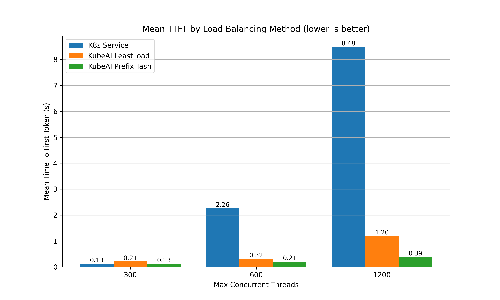

# LLM Load Balancing at Scale: Consistent Hashing with Bounded Loads

Conducted by [Substratus.AI](https://www.substratus.ai/), the creators of KubeAI.

## Abstract:

Operating large language models (LLMs) at scale in real-world scenarios necessitates multiple backend replicas. The inter-replica load balancing algorithm greatly influences overall system performance by impacting the caching dynamics inherent in modern inference engines. In this study, we explore the application of the Consistent Hashing with Bounded Loads (CHWBL) algorithm in the domain of LLM inference. We simulate real-world load patterns on Kubernetes, the industry's most widely adopted deployment platform.  Our results demonstrate a <u>95% reduction</u> in Time To First Token (TTFT) and a <u>127% increase</u> in overall throughput compared to the baseline strategy.

## 1. Introduction

Before an inference engine such as vLLM can begin generating output tokens, it must first process the input prompt during the “prefill phase”. The resulting intermediate representation is stored in a key-value (KV) cache. This cache can be reused across multiple requests that share the same prefix - a feature known as "prefix caching". The impact of prefix caching can be significant in several real world scenarios:

**Multi-turn Conversations:** In applications like chatbots (e.g., ChatGPT) or autonomous AI agents, every new turn appends to an evolving shared context.


**Multi-threaded Requests with Shared Context:**
Scenarios that involve multiple queries against a single long document are particularly sensitive to the efficiency of prefix caching. When requests are executed concurrently, even slight improvements in cache hit rates can lead to substantial reductions in end-to-end latency.


The conventional random routing strategy provided by Kubernetes often results in suboptimal cache utilization, leading to frequent cache evictions and degraded performance.


## 2. Problem Statement

An effective load balancing strategy for LLM serving should satisfy the following criteria:

**Maximize Cache Utilization:** Route requests with common prefixes to vLLM replicas with hot caches.

**Adapt to Replica Changes:** Minimize cache shuffling as replicas come and go.

**Avoid Uneven Load Distribution:** Prevent any single replica from becoming overloaded.

The Consistent Hashing with Bounded Loads (CHWBL) algorithm inherently addresses these challenges, making it a compelling choice for LLM load balancing.

## 3. Proposed Approach: CHWBL

The CHWBL algorithm extends traditional consistent hashing by incorporating load bounds, ensuring that no individual replica receives more than its fair share of requests. This approach not only preserves cache affinity but also prevents the overloading of any single server, thereby optimizing overall system performance.


## 4. Implementation

We integrated the CHWBL routing strategy into the <a href="https://github.com/substratusai/kubeai" target="_blank">KubeAI project</a> under the PrefixHash configuration. This strategy functions as follows:

1. **Request Inspection:** The incoming HTTP body is analyzed (OpenAI-formatted API request).
2. **Prefix Extraction:** A configurable prefix is extracted from the request (for example, using the first user message in chat completions).
3. **Hashing:** The extracted prefix is hashed using the `xxHash` algorithm.
4. **Replica Lookup:** The hash value is used to select the appropriate vLLM replica using the CHWBL algorithm.
The configuration is specified on a per-model basis via the following YAML snippet:

```yaml
kind: Model
spec:
  # ...
  loadBalancing:
    strategy: PrefixHash
    # Optional parameters:
    prefixHash:
      meanLoadFactor: 125
      prefixCharLength: 100
      replication: 256
```

## 5. Evaluation

### 5.1. Scenarios

We conducted experiments using three distinct load balancing strategies:

1. **Kubernetes Service (Random)**
    * Utilized the default Kubernetes Service, bypassing the KubeAI proxy.
    * Relied on `iptables` for proxying via kube-proxy.
2. **KubeAI (LeastLoad)**
    * Employed the KubeAI load balancer to route traffic to the replica with the fewest active requests.
3. **KubeAI (PrefixHash)**
    * Applied a CHWBL-driven strategy to route requests via the KubeAI proxy.

### 5.2. Setup

A Kubernetes cluster running KubeAI was setup with the following specifications:

* **Hardware:** 8x L4 GPUs
* **Software:** 8x vLLM instances
* **Model:** Llama 3.1 8B
* **Dataset:** Message threads derived from ShareGPT
* **Workload:** A custom load generator simulating parallel chat completion threads, preserving conversation state by appending LLM responses in a loop.

### 5.3. Metrics

Our evaluation focused on two key performance metrics:

* **Time To First Token (TTFT):** The latency before the first token is generated.
* **Tokens Per Second (TPS):** The overall throughput of token generation.

### 5.4. Results

The benchmark showed that the PrefixHash strategy resulted in significant improvements in TTFT and throughput compared to both the default Kubernetes Service and the LeastLoad strategy.

**TTFT:** The PrefixHash strategy resulted in a <u>95% reduction in Time to First Token</u> compared to the built-in Kubernetes strategy when the system was operating at 1200 concurrent threads (150 threads per replica).



**Throughput:** The PrefixHash strategy resulted in a <u>127% increase in throughput</u> compared to the built-in Kubernetes strategy when the system was operating at 1200 concurrent threads (150 threads per replica).


## 6. Conclusion

In this work, we demonstrated that incorporating the CHWBL algorithm into LLM load balancing through the PrefixHash strategy in KubeAI can significantly enhance performance in real-world scenarios. Notably, improvements in cache hit rates yielded lower latency and increased throughput. Moving forward, we plan to expand our benchmarks to cover a broader range of workloads. We plan to incorporate benchmarks for emerging strategies as they come out, with the ultimate aim of ensuring that KubeAI features the most effective load balancing techniques.

## References

* [vLLM Documentation on Automatic Prefix Caching](https://docs.vllm.ai/en/latest/features/automatic_prefix_caching.html)
* [Google Research: Consistent Hashing with Bounded Loads.](https://research.google/blog/consistent-hashing-with-bounded-loads/)
* [KubeAI Load Balancing Concepts](https://www.kubeai.org/concepts/load-balancing/)