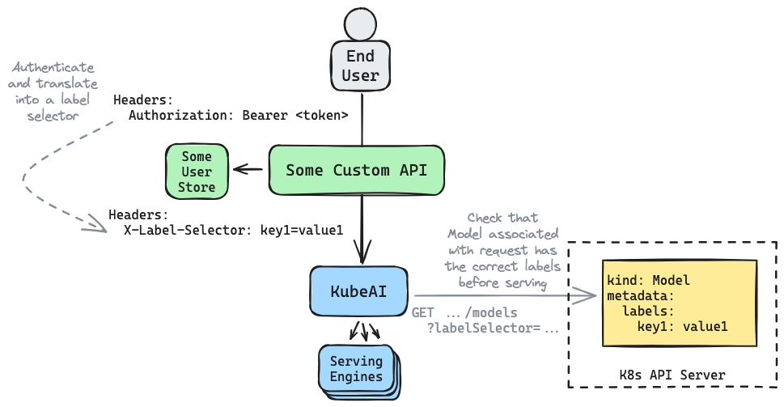

# Architect for Multitenancy

KubeAI can support multitenancy by filtering the models that it serves via Kubernetes [label selectors](https://kubernetes.io/docs/concepts/overview/working-with-objects/labels/#label-selectors). These label selectors can be specified on all OpenAI-compatible endpoints through the `X-Label-Selector` HTTP header and will match on labels specified on the `kind: Model` objects. The pattern is similar to using a `WHERE` clause in a SQL query.

Example Models:

```yaml
kind: Model
metadata:
  name: llama-3.2
  labels:
    tenancy: public
spec:
# ...
---
kind: Model
metadata:
  name: custom-private-model
  labels:
    tenancy: org-abc
spec:
# ...
```

Example HTTP requests:

```bash
# List of models will be filtered.
curl http://$KUBEAI_ENDPOINT/openai/v1/models \
    -H "X-Label-Selector: tenancy in (org-abc, public)"

# When running inference, if the label selector does not match
# a 404 will be returned.
curl http://$KUBEAI_ENDPOINT/openai/v1/completions \
    -H "Content-Type: application/json" \
    -H "X-Label-Selector: tenancy in (org-abc, public)" \
    -d '{"prompt": "Hi", "model": "llama-3.2"}'
```

Example architecture:



NOTE: Multiple `X-Label-Selector` headers can be specified in the same HTTP request and will be treated as a logical `AND`.
