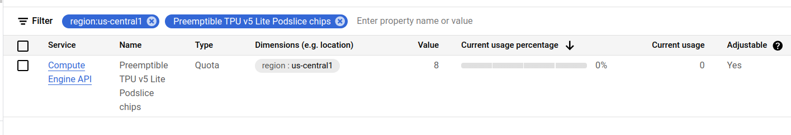
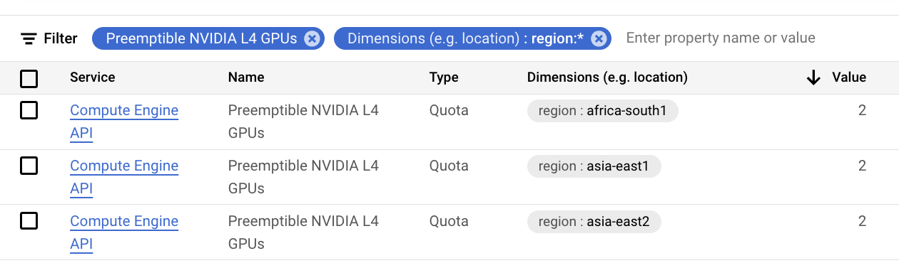
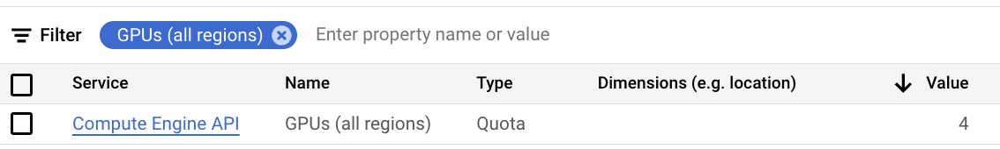

# Install on GKE

<details markdown="1">
<summary>TIP: Make sure you have enough quota in your GCP project.</summary>
Open the cloud console quotas page: https://console.cloud.google.com/iam-admin/quotas. Make sure your project is selected in the top left.

You will need to verify that you have enough quota for the accelerators you want to use.
Below is table of common quotas you will have to increase depending on your needs.

| Quota                      | Location      | Min Value |
|----------------------------|---------------|-----------|
| Preemptible TPU v5 Lite Podslice chips | `<your-region>` | 8 |
| Preemptible NVIDIA L4 GPUs | `<your-region>` | 2       |
| GPUs (all regions)         | -             | 2         |
| CPUs (all regions)         | -             | 24        |

See the following screenshot examples of how these quotas appear in the console:








</details>

## 1. Create a cluster

### Option: GKE Autopilot

Create an Autopilot cluster (replace `us-central1` with a region that you have quota).

```bash
gcloud container clusters create-auto cluster-1 \
    --location=us-central1
```

### Option: GKE Standard

TODO: Reference gcloud commands for creating a GKE standard cluster.

## 2. Install KubeAI

Add KubeAI Helm repository.

```bash
helm repo add kubeai https://www.kubeai.org
helm repo update
```

**Make sure** you have a HuggingFace Hub token set in your environment (`HUGGING_FACE_HUB_TOKEN`).

Install KubeAI with [Helm](https://helm.sh/docs/intro/install/).

```bash
curl -L -O https://raw.githubusercontent.com/substratusai/kubeai/refs/heads/main/charts/kubeai/values-gke.yaml
helm upgrade --install kubeai kubeai/kubeai \
    -f values-gke.yaml \
    --set secrets.huggingface.token=$HUGGING_FACE_HUB_TOKEN \
    --wait
```

## 4. Deploying models

Take a look at the following how-to guides to deploy models:
* [Configure Text Generation Models](../how-to/configure-text-generation-models.md)
* [Configure Embedding Models](../how-to/configure-embedding-models.md)
* [Configure Speech to Text Models](../how-to/configure-speech-to-text.md)