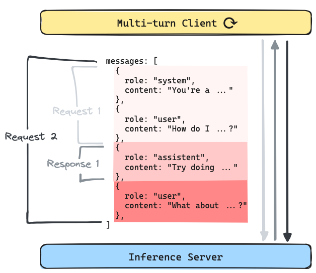
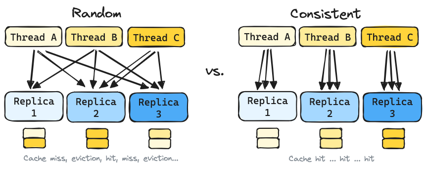
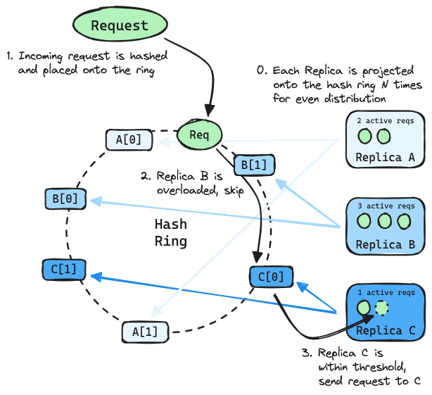

# LLM Load Balancing at Scale

*Using Consistent Hashing with Bounded Loads*

**TLDR:** Applying the Consistent Hashing with Bounded Loads (CHWBL) algorithm to LLM Load Balancing results in dramatic performance improvements over the default random strategy built into Kubernetes (`TODO`% reduction in TTFT).

## Introduction

This paper explores the effect of load balancing strategies across multiple LLM serving instances under production load patterns driven by use cases such as human chat or AI agents. These concepts are relevant no matter what platform you are using, however special attention will be given to vLLM on Kubernetes for practical purposes (being the defacto solution today).

### Background

Before an inference engine such as vLLM can start producing output tokens, it needs to first process the input text (this is called the "prefill phase"). The result of this phase is stored in a KV cache for future reference (this is called "prefix caching").

The impact of prefix caching can be significant in real-world shared-prefix scenarios such as multi-turn conversations and multi-threaded requests with shared context.

### 1. Multi-turn conversations

Common multi-turn usecases involve human clients (such as ChatGPT). Increasingly, AI clients ("Agents") are starting to account for an increasing share of inference requests. These multi-turn use-cases operate in a generate-append-generate loop, where the last response ends up being incorporated into the prefix for the next request. The result is an ever-growing shared prefix.

</img>

### 2. Multi-threaded requests with shared context

Use cases such as running multiple queries against the same long document are especially sensitive to prefix caching. End-to-end request time tends to be dominated by the time it takes to process the large input context and less influenced by the short answer that is expected from the LLM. This is true when requests are run in sequence but is even more pronounced when requests are run in parallel.

</img>

### Why it matters

When operating at scale (multiple replicas of vLLM) and under load (at the threshold of KV cache-space), the right load balancing strategy can maximize cache-hits while the wrong strategy will result in frequent misses (cache-evictions).

The default random strategy built into Kubernetes leaves a lot of performance on the table. A more consistent routing strategy would be better to keep a relevant cache on each replica.

</img>

## Finding the right algorithm

The ideal load balancing algorithm should be able to:

1. Route requests with the same prefix to the same vLLM replica.
2. Keep routing as consistent as possible when the number of replicas changes.
3. Avoid overloading any single vLLM replica.

This is exactly the problem that the Consistent Hashing with Bounded Loads (CHWBL) algorithm was designed to tackle.



## KubeAI implementation

KubeAI now provides a `PrefixHash` load balancing strategy that can be configured on a per-model basis.

```yaml
kind: Model
spec:
  # ...
  loadBalancing:
    strategy: PrefixHash
```

When using this strategy, KubeAI will:

1. Inspect the incoming request body.
2. Extract a prefix of up to a configured length (for chat completion requests the first user message is used).
3. Hash the extracted prefix.
4. Lookup the vLLM replica according to the CHWBL algorithm.

## Performance results

Three load balancing scenarios were tested:

1. Kubernetes Service (Random)
    * Implemented via a standard Kubernetes Service that bypassed KubeAI (avoided proxying overhead).
    * The kube-proxy was configured to use `iptables` proxying.
2. KubeAI (LeastLoad)
    * Proxied through KubeAI load balancer.
    * Routes traffic to the replica with the least number of in-flight requests.
3. KubeAI (PrefixHash)
    * Proxied through KubeAI load balancer.
    * Routes traffic to replicas according the CHWBL strategy described above.

### Methodology

The benchmark was conducted with:

* Hardware: 8x L4 GPUs
* Software: 8x vLLM instances
* Model: Llama 3.1 8B
* Dataset: Messsage threads from ShareGPT

A new benchmark load generator was created to simulate an agentic workload. Multiple distinct chat completion threads were ran in parallel. The load generator maintained thread state: LLM response messages were captured and appended in a loop until all input messages were processed.

### Results

Several key performance numbers were considered:

1. TTFT - Time To First Token - How long the user waits for the model to start generating output.
2. ITL - Inter-Token Latency - How long the user waits for each subsequent token to be generated.
3. TPS - Tokens Per Second (throughput) - The total number of tokens generated each second by the system.

Overview of the results:

Improvements to ITL and TPS were seen across the board when using the PrefixHash strategy, with the most dramatic improvement showing up in TTFT.

Summary of Time To First Token (TTFT):

TODO

Summary of Inter-Token Latency (ITL):

TODO

Summary of Tokens Per Second (TPS):

TODO

## Conclusion

TODO

## References

* https://docs.vllm.ai/en/latest/features/automatic_prefix_caching.html
* https://research.google/blog/consistent-hashing-with-bounded-loads/
* https://www.kubeai.org/concepts/load-balancing/