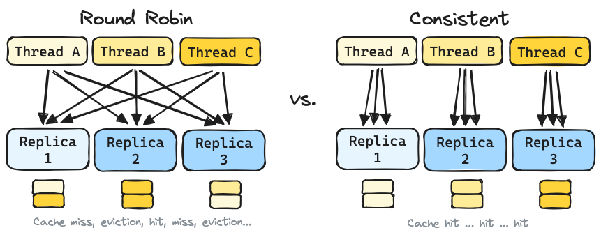

# LLM Load Balancing at Scale

**TLDR:** Applying the Consistent Hashing with Bounded Loads (CHWBL) algorithm to LLM Load Balancing results in dramatic performance improvements over the default round robin strategy built into Kubernetes.

## Introduction

Before an inference engine such as vLLM can start producing output tokens, it needs to first process the input text (this is called the "prefill phase"). The result of this phase is stored in a KV cache for future reference (this is called "prefix caching").

The impact of prefix caching can be significant, especially in multi-turn use-cases such as chat, whether the client is a human or an "agent". This is because multi-turn use-cases operate in a generate-append-generate loop, where the last response ends up being incorporated into the prefix for the next request.

</img>

When operating at scale (multiple replicas of vLLM) and under load (at the threshold of KV cache-space), choosing a load balancing strategy that can maximize cache-hits and minimize cache-evictions becomes critical.

The default round robin strategy built into Kubernetes leaves a lot of performance on the table. Some sort of consistent routing strategy would be better to keep a relevant cache on each replica.

</img>

## Finding the right algorithm

The ideal load balancing algorithm should be able to:

1. Route requests with the same prefix to the same vLLM replica.
2. Keep routing as consistent as possible when the number of replicas changes.
3. Avoid overloading any single vLLM replica.

This is exactly the problem that the Consistent Hashing with Bounded Loads (CHWBL) algorithm was designed to tackle.


## KubeAI implementation

KubeAI now provides a `PrefixHash` load balancing strategy that can be configured on a per-model basis.

```yaml
kind: Model
spec:
  # ...
  loadBalancing:
    strategy: PrefixHash
```

When using this strategy, KubeAI will:

1. Inspect the incoming request body.
2. Extract a prefix of up to a configured length. 
    * NOTE: For chat completion requests - the first user message is used.
3. Hash the extracted prefix.
4. Lookup the vLLM replica that has a hash value closest to the hash value of the request (unidirectional).
    * NOTE: The next closest replica is considered if the current replica is serving too many requests.

## Performance results


## Conclusion

TODO

## References:

* https://docs.vllm.ai/en/latest/features/automatic_prefix_caching.html
* https://research.google/blog/consistent-hashing-with-bounded-loads/
* https://www.kubeai.org/concepts/load-balancing/