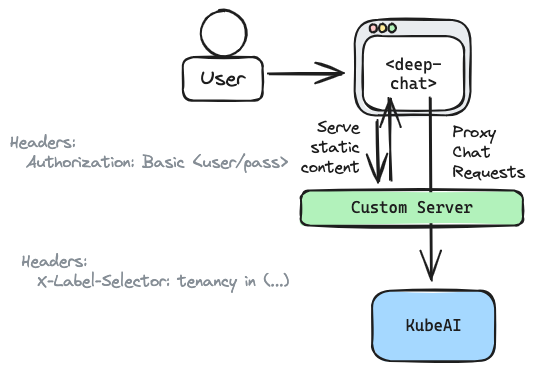

# Private Chat App

In this tutorial you are going to deploy a custom, multitenant private chat application. The Chat UI is powered by [Deep Chat](https://deepchat.dev/) - an open source web component that is easy to embed into any frontend web app framework or simple HTML page. KubeAI will be used to ensure that all chat interactions are kept private within the cluster.



## Guide

Follow the local installation guide in the [quickstart section](/). Avoid installing any models.

```bash
git clone https://github.com/substratusai/kubeai
cd ./kubeai/examples/private-deep-chat
```

Build the private chat application and load the image into the local kind cluster.

```bash
docker build -t private-deep-chat:latest .
kind load docker-image private-deep-chat:latest
```

Deploy the private chat application along with some KubeAI Models.

```bash
kubectl apply -f ./manifests
```

Start a port-forward.

```bash
kubectl port-forward svc/private-deep-chat 8000:80
```

In your browser, navigate to <a href="http://localhost:8000/" target="_blank">localhost:8000</a>.

Login as any of the following users:

|User|Password |
|----|---------|
|nick|nickspass|
|sam |samspass |
|joe |joespass |

These users each have access to different KubeAI Models. You can see this assignment by looking at the user mapping in `./main.go` and the associated `tenancy` label on the Models in `./manifests/models.yaml`.