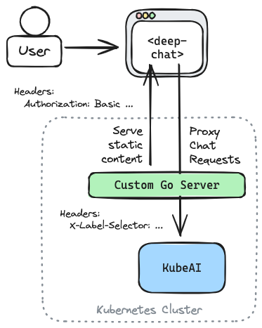

# Private Deep Chat

In this tutorial you are going to deploy a custom, multitenant, private chat application. The Chat UI is powered by <a href="https://deepchat.dev/" target="_blank">Deep Chat</a> - an open source web component that is easy to embed into any frontend web app framework or simple HTML page. KubeAI will be used to ensure that all chat interactions are kept private within the cluster.


In this example, we will deploy a custom Go server that will authenticate users using <a href="https://developer.mozilla.org/en-US/docs/Web/HTTP/Authentication#basic_authentication_scheme" target="_blank">Basic Authentication</a>. When a webpage is requested, a simple HTML page with the `<deep-chat>` web component will be served. We will configure Deep Chat and KubeAI to communicate using the OpenAI API format:

```html
<deep-chat
    connect='{"url":"/openai/v1/chat/completions", ... }'
    directConnection='{"openAI": ... }'>
</deep-chat>
```

When the HTML page loads we will use Javascript to make an initial request to fetch available models. The Go server will proxy this request to KubeAI:

```go
proxyHandler := httputil.NewSingleHostReverseProxy(kubeAIURL)

http.Handle("/openai/", authUserToKubeAI(proxyHandler))
```

The server will translate the username and password provided in the basic auth header into a label selector that will tell KubeAI to filter the models it returns. The same approach will also be used to enforce access at inference-time.

```go
r.Header.Set("X-Label-Selector", fmt.Sprintf("tenancy in (%s)",
	strings.Join(tenancy, ","),
))
```

While this is a simple example application, this overall architecture can be used when incorporating chat into a production application.



## Guide

Create a local cluster with <a href="https://kind.sigs.k8s.io/" target="_blank">kind</a> and install KubeAI.

```bash
kind create cluster

helm repo add kubeai https://www.kubeai.org && helm repo update
helm install kubeai kubeai/kubeai --set openwebui.enabled=false --wait --timeout 5m
```

Clone the KubeAI repo and navigate to the example directory.

```bash
git clone https://github.com/substratusai/kubeai
cd ./kubeai/examples/private-deep-chat
```

Build the private chat application and load the image into the local kind cluster.

```bash
docker build -t private-deep-chat:latest .
kind load docker-image private-deep-chat:latest
```

Deploy the private chat application along with some KubeAI Models.

```bash
kubectl apply -f ./manifests
```

Start a port-forward.

```bash
kubectl port-forward svc/private-deep-chat 8000:80
```

In your browser, navigate to <a href="http://localhost:8000/" target="_blank">localhost:8000</a>.

Login as any of the following users:

|User|Password |
|----|---------|
|nick|nickspass|
|sam |samspass |
|joe |joespass |

These users each have access to different KubeAI Models. You can see this assignment by looking at the user mapping in `./main.go` and the associated `tenancy` label on the Models in `./manifests/models.yaml`.