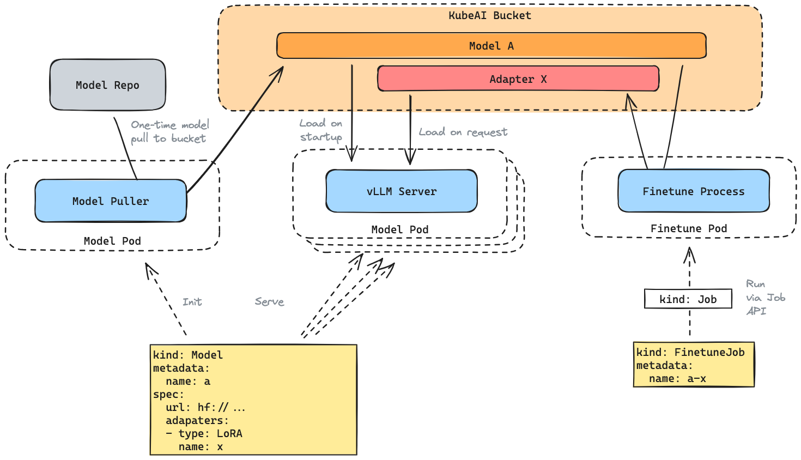

# Model Management

## Problem

This proposal is attempting to solve the following problems:

* Slow model loading on cold-start
* Storage of LoRA adapters generated from finetuning jobs
* Dynamic LoRA adapter injection

While working within the following constraints:

* KubeAI should be able to be installed with a single command
* KubeAI should not rely on external dependencies to provide basic functionality
* KubeAI should be able to run on a local machine
* KubeAI should be able to be run on clouds with heterogenous disk features (limited support for ReadOnlyMany)

## Solution

KubeAI should support configurable storage for both models and adapters.

These settings should be configurable on a per Model basis because the optimum caching technique is relative to the size and frequency-of-use of the model. For example: GCP Hyperdisk ML is relatively expensive compared to other options, however it can be highly performant especially when it comes to loading large models. They should also be configurable on a per-finetune-job basis so that users can use KubeAI to publish adapters to their huggingface repos.

### Example Models

```yaml
# Model configured with adapters from huggingface
kind: Model
spec:
  url: "hf://meta-llama/Meta-Llama-3.1-8B-Instruct"
  adapters:
  # Adapter can be requested by name at inference time
  - name: sarcasm
    url: "hf://myrepo/sarcastic-lora-adapter-for-llama-3-8b-Instruct"

# Model that explicitly asks for a cache profile
kind: Model
spec:
  url: "hf://meta-llama/Meta-Llama-3.1-405B-Instruct"
  cacheProfile: HyperDisk

# A Model without any cache specified will use the default set in KubeAI's config.yaml
kind: Model
spec:
  url: "hf://meta-llama/Meta-Llama-3.1-8B-Instruct"

# Model that explicitly wont use a cache
kind: Model
spec:
  # NOTE: URL could also be from an location such as "s3://..." (or possibly a shared filesystem like EFS?)
  url: "hf://meta-llama/Meta-Llama-3.1-8B-Instruct"
  cacheProfile: None
```

### Finetuning Example

If a user submits a finetuning request (`POST /v1/fine_tuning/jobs`), they have the option to specify a location to store the adapters:

```json
# OpenAI-compatible finetune job request
{
  # Model.metadata.name
  "model": "llama-3.1-8b",
  # KubeAI-Only: Training file could be specified as URL: "s3://..."
  "training_file": "<id-of-file-uploaded-via-files-api>",
  # KubeAI-Only: Location to store parameters
  # Alternative: "hf://some-user/some-repo"
  # If not specified, default location determined from KubeAI config.yaml.
  "storage_url": "s3://some-bucket/some-dir/"
}
```

After this job completes the base Model would have an adapter appended:

```yaml
kind: Model
spec:
  url: "hf://meta-llama/Meta-Llama-3.1-8B-Instruct"
  adapters:
  # +Adapter:
  - name: "name-of-finetune-job"
    url: "s3://some-bucket/some-dir/name-of-finetune-job"
```

Users can specify an adapter by name at inference time.

### KubeAI Config

Model cache profiles and finetune default storage locations should be defined at the KubeAI `config.yaml` level:

```yaml
finetuning:
  storage:
    defaultURLTemplate: "s3://my-bucket/finetuning/{model}/{job}"
  
models:
  cache:
    defaultProfile: Bucket # Could also be "None"
    profiles:
      # Admins can define their own profile settings (and profile names):
      StandardBucket:
        bucket:
          url: s3://my-bucket/models/
      EFS:
        sharedFilesystem:
          storageClass: aws-efs
          mode: SharedFilesystem
          baseDir: /models/
      HyperDisk:
        staticVolume:
          storageClass: gcp-hyperdisk
```

Default config set from Helm values might look like:

```yaml
models:
  cache:
    defaultProfile: None
    profiles: {}
```

### Cache Options

#### Bucket Storage

This mode relies on access to a bucket.

To preserve local deployment as an option this bucket could be provided by a Helm-deployed instance of Minio (possible License issue?), OR [SeaweedFS](https://github.com/seaweedfs/seaweedfs) (mature/secure?).



#### Volume Storage

##### Shared Filesystem Storage

This mode relies on a Kubernetes PersistentVolumes for storage.

- How it works: always mounted as ReadWriteMany
- Examples:  - NFS, EFS, GCP Filestore
- Works for models and adapaters.
- Typically provisioned outside of the k8s API

##### Static Volume Storage

This mode relies on a Kubernetes PersistentVolumes for storage.

- How it works: mounted as ReadWriteOnce to initialize, then ReadOnlyMany for serving
- Examples: GCP Hyperdisk ML, GCP PD (see restrictive limits below)
- Cloud-specific limits on number of VMs that disks can be attached to should be taken into account - see [GCP disk limits](https://cloud.google.com/compute/docs/disks/sharing-disks-between-vms#restrictions_for_sharing_disks_in_read-only_mode).
- Typically provisioned via the k8s API

NOTE: Only static volume storage would be only supported for models, NOT adapters:

Disks like Hyperdisk ML (and other PDs in GCP) can be mounted as ReadWriteOnce or ReadOnlyMany ... Supporting this type of disk for adapters is complicated:

* A finetune Job would need to output adapters by mounting a new disk in RWO mode (doable - but forces 1:1 adapter-to-disk which is probably not justified based on adapter's being small in size)
* Model servers need to be able to mount these adapter-specific disks dynamically to swap the adapter that is being used for a given server like vLLM on a request by request basis - see Support dynamic LoRA serving #132 (I dont know of a way of doing this as volumes specified in a Pod spec are not dynamic - require Pod recreation)


## Relevant Reading

* [KServe Cache Proposal](https://docs.google.com/document/d/1nao8Ws3tonO2zNAzdmXTYa0hECZNoP2SV_z9Zg0PzLA)
